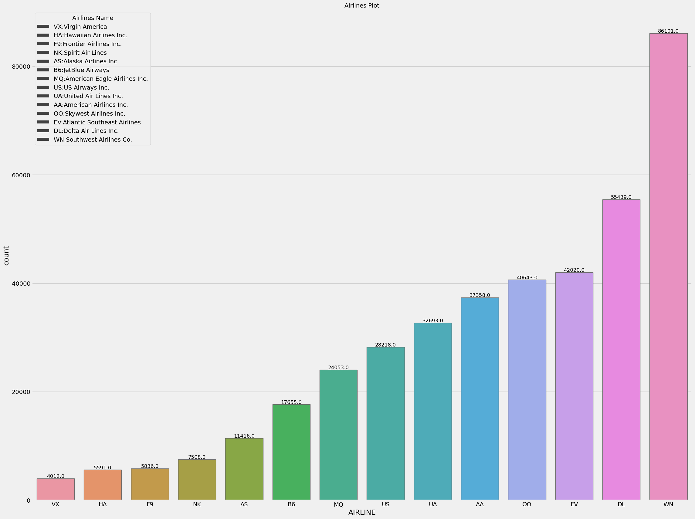
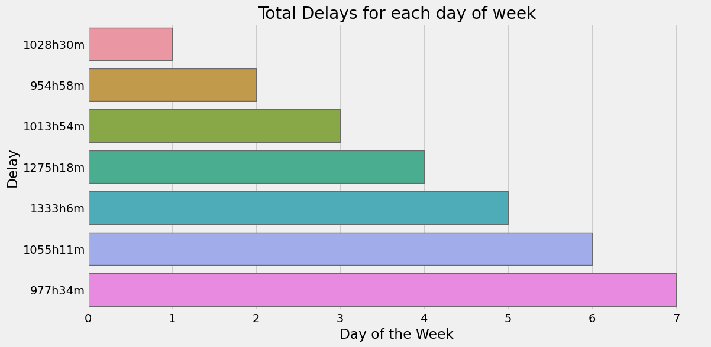
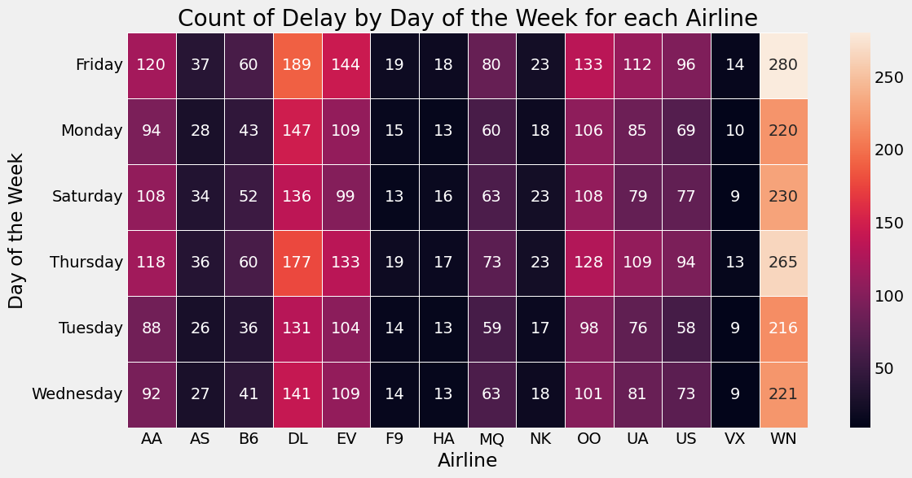
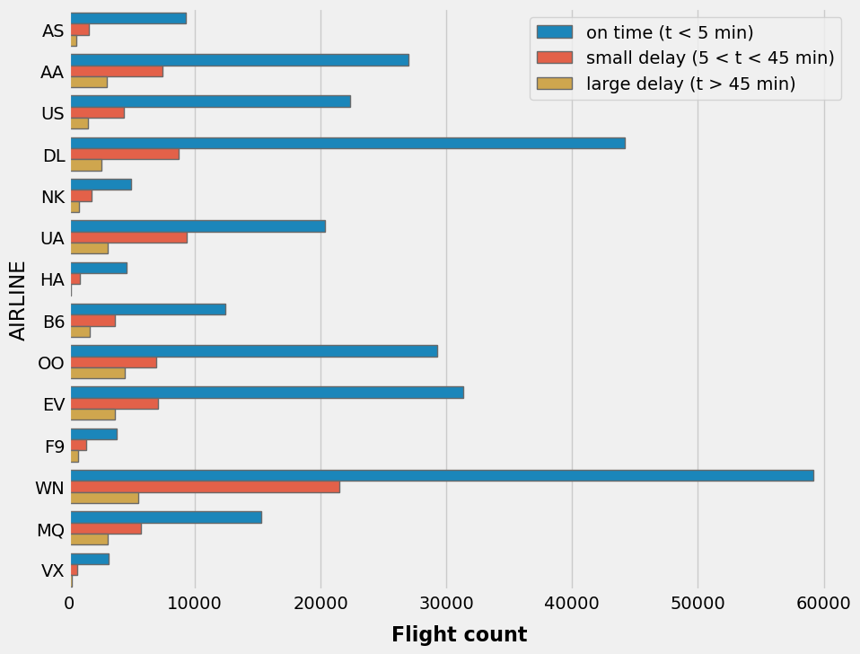

# Fligh Delay Insights - Python
In this project, I analyzed flight delays using Python, and I leveraged libraries such as pandas, matplotlib, and seaborn. I made thoughtful decisions about the types of plots to create, considering whether the variables were categorical or numerical. Additionally, I performed a preprocessing step to handle date and time data. The original dataset had these values separated into different columns, which hindered the use of pandas functions for working with date and time information.
# Preprocessing
1. Dealing with null values
2. Dealing with time and turn in to date time pattern

# Goals
1. Which airline has the most flights?
2. On which day was the delay highest?
3. At what hour was the delay highest for each airline?
4. Count delays that are less than 5 minutes, between 5 and 45 minutes, and more than 45 minutes.

## Data
The detailed data was collected through https://www.kaggle.com/code/fabiendaniel/predicting-flight-delays-tutorial/input.
  The original dataset contained 581,907,9 rows and 31 columns but after cleaning the data and just selecting the month of january to decrease the amount of data, there were 469,968 rows and 13 columns.

## Which airline has the most flights?
This is a list of all the airlines along with the count of their flights. As we can see, WN airline had the highest number of flights among all the airlines. Additionally, I have created a legend for this plot based on another dataset named "airline" using a one-to-many relationship between the two datasets.

## At which day the delay was higher?
This plot displays the total count of delays for all airlines based on the days of the week. We can observe that the majority of delays occurred on Friday. 

However, a question arises: which airline had the most delays among all the airlines on Friday?
## At what hour the delay was higher for each airline?
This plot is a heatmap that visualizes the count of flight delays for different airlines across various days of the week. I chose to use a heatmap because I had three variables, and I wanted to examine the relationship between these three variables. Therefore, a heatmap was a suitable choice for this analysis. As we can see in the plot, the WN airline had the highest number of delays, and these delays were more frequent on Fridays compared to other days.

## Count delays that are less than 5 min, between 5 and 45 min and more than 45 min
This plot shows the number of different types of flight delays: those under 5 minutes, those between 5 and 45 minutes, and those over 45 minutes. Regardless of the airline, long delays (over 45 minutes) make up only a small percentage. However, the proportion of delays in these categories varies by airline. For example, SkyWest Airlines has about 30% fewer long delays compared to medium delays (5-45 minutes), whereas Southwest Airlines has four times fewer long delays than medium delays.

## Conclusion
In conclusion, the provided visualizations and data present several key insights about airline flights and delays:

**Airline Count:** The list of airlines and their respective flight counts highlights that WN airline had the most flights among all the airlines, indicating their significant presence in the dataset.

**Day-Based Delays:** The plot illustrating delays based on days of the week indicates that the majority of flight delays occurred on Fridays. This information can be valuable for both airlines and passengers when planning their travel schedules.

**Heatmap Analysis:** The heatmap visualization, which examines flight delays across different airlines and days of the week, provides a comprehensive overview of how delays are distributed. It helps us understand that WN airline had the highest number of delays, particularly on Fridays. This insight can guide airline companies in identifying areas for improvement in their scheduling or operations.

**Delay Categories:** The plot that categorizes delays into three groups (under 5 minutes, 5-45 minutes, and over 45 minutes) for various airlines reveals that, regardless of the airline, long delays (over 45 minutes) constitute a relatively small portion of the delays. However, the distribution of delays in these categories varies between airlines, with some airlines experiencing a higher proportion of medium delays (5-45 minutes) compared to long delays.

These insights can be valuable for airlines and travelers alike. Airlines can use this information to optimize their operations and minimize delays, especially on Fridays. Passengers can make more informed decisions when planning their trips, potentially avoiding peak delay times and airlines with specific delay patterns.

